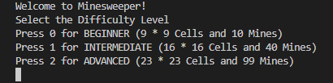
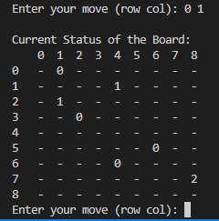
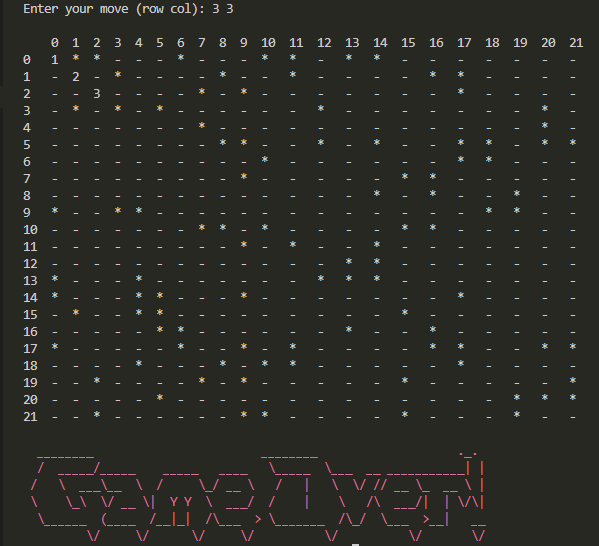

# Terminal Minesweeper 
Minesweeper written in C for linux terminal based on the original Microsoft Game relased in 1989. 

## Background Information
Minesweeper in C is played on a square board and we have to open cells on the board which do not have a mine. We do not know where the mines are.
If a cell where is mine is located is opened then the game is lost, else we are still in the game until all non mine cells are opened. 

There are three levels for this game: 
1. **BEGINNER** - 9 * 9 Board and 10 Mines
2. **INTERMEDIATE** - 16 * 16 Board and 40 Mines
3. **ADVANCED** - 22 * 22 Board and 99 Mines

Probability of finding a mine:
- Beginner level - 10/81 (12.35%)
- Intermediate level - 40/256 (15.63%)
- Advanced level - 99/484 (20.45%)

This implementation in C focuses on utilising arrays learnt from COMP1511 (Programming Fundamentals). 
Additionaly it features implementations of switch statments and Makefile.  

## Instructions
Just compile and run it. A Makefile is provided for simplicity. The game is written for linux terminal.

## Rules
Just regular Minesweeper stuff. Except cells only break one at a time making it slighlty more difficult. 

## Screenshots

Have fun playing the game :D

Note: This code uses global variables. Global variables are often considered bad style and sometimes break things.
